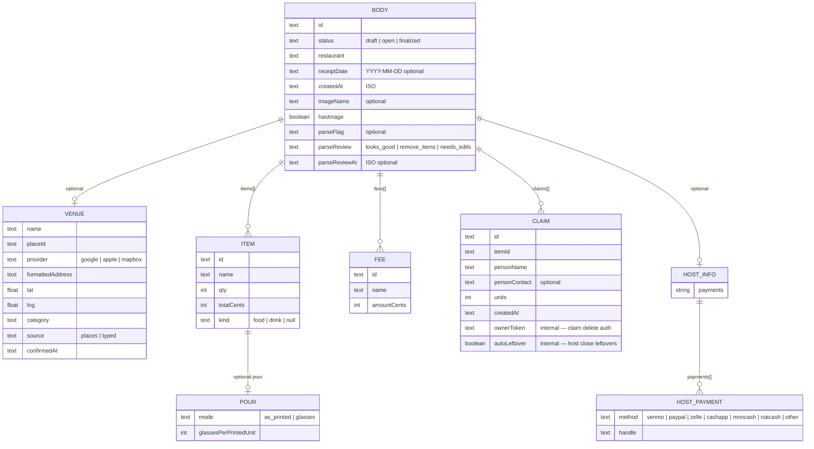
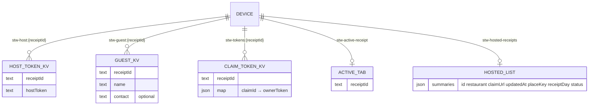

# Physical data model (ERD)

**Status:** as-shipped (production Postgres on Railway + blob store + native AsyncStorage)  
**Schema:** `split_the_wine`  
**Source of truth for DDL:** [`src/lib/db.ts`](../src/lib/db.ts), [`src/lib/receipt-image.ts`](../src/lib/receipt-image.ts)  
**Document body shape:** [`src/lib/types.ts`](../src/lib/types.ts) + internal claim fields in store

This is the **current physical** model — not the planned B2B `tab_facts` / usage funnel tables ([b2b-venue-insights.md](./b2b-venue-insights.md), [telemetry-eval.md](./telemetry-eval.md) Phase 1b).

---

## Overview

| Store | What lives there |
|---|---|
| **Postgres** `split_the_wine.*` | Receipt document (jsonb), claim→receipt index, host push tokens, image metadata |
| **Object storage** (Railway Bucket / S3-compatible) | Receipt photo bytes (`storage_key`) |
| **Native AsyncStorage** | Host token, guest identity, claim-owner tokens, hosted-tab list (device-local) |
| **In-memory (no `DATABASE_URL`)** | Same logical model in process maps + optional `.data/receipt-images/` |

---

## Mermaid ERD — Postgres + blob

```mermaid
erDiagram
  RECEIPTS ||--o| RECEIPT_IMAGES : "has photo meta"
  RECEIPTS ||--o{ CLAIM_LOOKUP : "indexes claims"
  RECEIPTS ||--o{ HOST_PUSH_TOKENS : "host devices"
  RECEIPT_IMAGES }o--o| BLOB_OBJECT : "bytes via storage_key"

  RECEIPTS {
    text id PK
    text host_token "secret — column, not in body"
    jsonb body "full tab document — see below"
    timestamptz created_at
    timestamptz updated_at
  }

  CLAIM_LOOKUP {
    text claim_id PK
    text receipt_id FK "ON DELETE CASCADE"
  }

  HOST_PUSH_TOKENS {
    text receipt_id FK "ON DELETE CASCADE"
    text token "Expo push token"
    text platform "nullable"
    timestamptz updated_at
  }

  RECEIPT_IMAGES {
    text receipt_id PK_FK "ON DELETE CASCADE"
    text mime
    bytea bytes "legacy nullable — prefer blob"
    int byte_size
    text storage_key "object key when using blob"
    timestamptz updated_at
  }

  BLOB_OBJECT {
    text key PK "receipts/{id}/original.{ext}"
    bytes content "not in Postgres"
    text mime
  }
```

### Indexes (physical)

- `receipts_updated_at_idx` on `receipts(updated_at DESC)`
- `host_push_tokens_receipt_idx` on `host_push_tokens(receipt_id)`
- PKs as above

---

## `receipts.body` (jsonb document)

`host_token` is **not** inside `body` — it is a table column. Everything else on the in-memory `InternalReceipt` is serialized into `body` (including private claim fields).



**Claim capacity (logical, not a column):**  
`claim units` remaining = `qty` when `pour` absent/`as_printed`, else `qty × glassesPerPrintedUnit`. Stored claims still use integer `units` against that capacity.

**Public API strip:** responses omit `ownerToken` / `autoLeftover` and add computed `remaining: Record<itemId, number>`.

---

## Object storage

| Key pattern | Value |
|---|---|
| `receipts/{receiptId}/original.{jpg\|png\|…}` | Image bytes + mime |

Configured via `OBJECT_STORAGE_*` (endpoint, bucket, keys, region). If unset and DB is on, older path may keep `receipt_images.bytes` (legacy).

On **DELETE** closed receipt: row cascade removes `receipt_images` / `claim_lookup` / `host_push_tokens`; app also deletes blob by `storage_key` best-effort.

---

## Native device (AsyncStorage) — not in Postgres



Clearing a tab from the host desk removes local list/token entries; server delete is separate (closed tabs only).

---

## Local / memory backend (dev)

When `DATABASE_URL` is unset:

- `Map` of receipts + claim id lookup + push tokens + SSE listeners in process  
- Images: memory map and/or `.data/receipt-images/{id}.bin` + `.mime`

Same logical document as `body`; no physical FK tables.

---

## Not physical yet (planned only)

| Planned | Plan |
|---|---|
| `tab_facts`, venue rollups | [b2b-venue-insights.md](./b2b-venue-insights.md) |
| `usage_events` (`tab.published` / `claim.created` / `tab.finalized`) | [telemetry-eval.md](./telemetry-eval.md) Phase 1b |

---

## Quick reference — table DDL (production)

```sql
-- schema: split_the_wine

receipts (
  id text PRIMARY KEY,
  host_token text NOT NULL,
  body jsonb NOT NULL,
  created_at timestamptz NOT NULL DEFAULT now(),
  updated_at timestamptz NOT NULL DEFAULT now()
);

claim_lookup (
  claim_id text PRIMARY KEY,
  receipt_id text NOT NULL REFERENCES receipts(id) ON DELETE CASCADE
);

host_push_tokens (
  receipt_id text NOT NULL REFERENCES receipts(id) ON DELETE CASCADE,
  token text NOT NULL,
  platform text,
  updated_at timestamptz NOT NULL DEFAULT now(),
  PRIMARY KEY (receipt_id, token)
);

receipt_images (
  receipt_id text PRIMARY KEY REFERENCES receipts(id) ON DELETE CASCADE,
  mime text NOT NULL,
  bytes bytea,              -- legacy / nullable
  byte_size integer,
  storage_key text,         -- blob object key
  updated_at timestamptz NOT NULL DEFAULT now()
);
```
