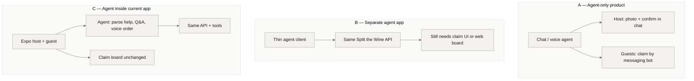
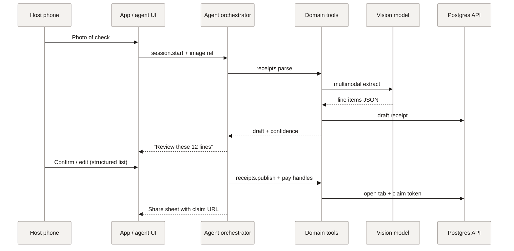
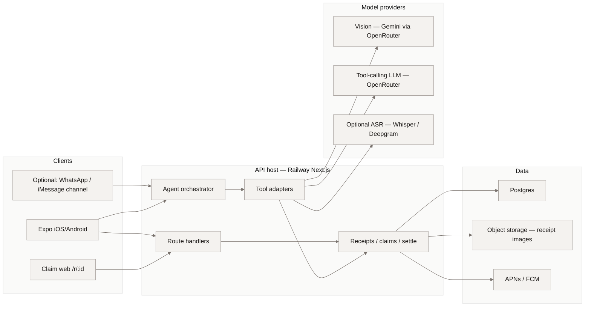

# Agent replacement plan — Split the Wine

Status: **Phase 0–1 in progress on branch `in-app-agent`.**  
Updated: 28 Sep 2026  
Related: [requirements.md](./requirements.md), [ui-flows.md](./ui-flows.md), [phase-3-voice.md](./phase-3-voice.md), [guest-first-reconcile.md](./guest-first-reconcile.md)  
UI sketch (open in browser): [agent-ui-sketch.html](./agent-ui-sketch.html)

### Shipped on `in-app-agent` (Phase 0–1 slice)

| Piece | Where |
|---|---|
| Heuristics + Flash phrasing | `src/lib/agent/*` |
| Host API | `POST /api/receipts/[id]/agent` (`x-host-token`) |
| Mobile sheet | `HostAgentSheet` on host **Items** + **Fees** (“Assistant”) |
| Cost caps | `AGENT_MAX_*` + `OPENROUTER_AGENT_MODEL` in `.env.example` |
| **Scope lock** | `src/lib/agent/scope.ts` — only tab items/fees/tax/tip/math; regex gate + model `onTopic` |

Draft stays on-device until publish; agent returns **cards**; host taps **Apply**. Guest claim board unchanged. Off-topic chat is refused.

---

## Verdict (read this first)

| Question | Answer |
|---|---|
| Can an AI agent fully replace this app? | **No** — not as a chat-only product for multi-guest claiming. |
| Can an agent absorb most of the *host* path? | **Yes** — photo → parse → confirm → share, with the same backend. |
| Best shape | **Agent layer inside the existing app**, not a separate consumer app. |
| Friction vs current UI (overall night) | Agent-only ≈ **+35% friction**. Agent-in-app ≈ **−20% friction** (host), **0%** (guest board). |
| Likelihood of matching today’s job-to-be-done | Agent-only **~30%**. Agent-assisted same product **~80%**. |

Friction and success % below are **judgment estimates** for a friend-group bar/restaurant split (4–8 guests, one host, Venmo/Cash App settle). They are not measured KPIs.

---

## 1. What “replace” would have to mean

Today’s product is not a chatbot. It is a **shared ledger with a phone-shaped UI**:

1. Host captures receipt → vision parse → human review → pay handles → claim link.  
2. Guests open one board → claim whole-number qty → live remaining → settle deep links.  
3. Correctness is **shared mutable inventory** (qty left), not a conversation summary.

An agent that “replaces the app” must still provide:

| Capability | Why a free-form agent fails alone |
|---|---|
| Shared claim inventory | Chat has no default multi-user concurrency model |
| Instant guest UX on a link | SMS/iMessage “talk to the bot” loses the claim board’s scanability |
| Deterministic money math | LLM arithmetic is unreliable; tax/tip must stay in code |
| Pay deep links | Needs structured handles + OS URL schemes, not prose |
| Host review of parse errors | Vision still errs; humans need a list UI, not a paragraph |

**Conclusion:** the durable replacement target is **agent as orchestrator over the same domain API**, with a **claim board (or equivalent structured surface) for guests**. Chat replaces *navigation and explanation*, not the ledger.

---

## 2. Three product shapes

| Shape | Separate app? | Recommendation |
|---|---|---|
| **A. Agent-only** | Yes (new product) | Do not ship as the primary product. Research / novelty only. |
| **B. Separate agent shell** | Yes, wrapping same API | Only if a partner channel (WhatsApp, iMessage, Slack) is the distribution bet. Still keep `/r/:id` board. |
| **C. In-app agent** | No — feature of Split the Wine | **Preferred.** Matches Phase 3 voice direction and host interview philosophy. |

---

## 3. How an agent would run (happy path)

### 3.1 Host night (agent-assisted)

The agent **calls tools**; it does not invent remaining quantities or owes.

### 3.2 Guest night (must stay structured)

Guests should **not** claim primarily by chatting (“I’ll take the Negroni”). Ambiguity, typos, and race conditions explode at a loud table.

Preferred guest path (unchanged product truth):

1. Open claim link → join with name.  
2. Tap lines / qty on the board (SSE/poll for remaining).  
3. Settle via Venmo / Cash App / PayPal deep links.

Agent value for guests is **assist only**:

- “What did I likely order?” (Phase 3 voice draft → suggest claims)  
- “How much do I owe?” after claims  
- “Open Venmo for $42” → deep link tool  

Not: replace the board with a group chat bot.

---

## 4. Architecture

### 4.1 System context

### 4.2 Agent runtime (inside the API)

| Layer | Responsibility | Must not do |
|---|---|---|
| **Session** | Per-host (or per-guest) thread, short TTL, no long-lived accounts required | Persist private chat forever |
| **Orchestrator** | Plan steps, call tools, ask clarifying questions | Write remaining qty by hand |
| **Tools** | Thin wrappers over existing HTTP/domain functions | Bypass auth / host ownership |
| **Policy** | Max tool calls, spend caps, PII redaction in logs | Send money automatically |
| **UI surfaces** | Return structured cards (item list, share URL) to the client | Rely on prose as source of truth |

Suggested tool surface (maps 1:1 to today’s API):

| Tool | Maps to |
|---|---|
| `parse_receipt` | `POST /api/receipts/:id/parse` |
| `update_draft_lines` | host review mutations |
| `set_pay_handles` | host-info / pay methods |
| `publish_tab` | open + mint claim token |
| `list_remaining` | claim board read |
| `claim_qty` | claim mutation (idempotent) |
| `compute_settle` | settle math (code, not LLM) |
| `pay_deeplink` | Venmo / Cash App / PayPal URL builder |
| `notify_host` | existing push path |

### 4.3 Services & hosting (concrete)

| Concern | Recommended service | Notes |
|---|---|---|
| **API + orchestrator** | Railway (current Next.js `api`) | Keep one deploy unit; agent is a route + worker, not a second host |
| **Postgres** | Existing Railway Postgres | Ledger remains source of truth |
| **Receipt images** | Existing object storage path | Agent gets signed URLs / ids, never re-uploads blindly |
| **Vision** | OpenRouter → `google/gemini-2.5-flash` (current) | Structured JSON contract unchanged |
| **Tool-calling LLM** | OpenRouter → **same Flash family** (default); optional lite | Not Sonnet/GPT on every turn — see §4.4 |
| **ASR (optional)** | Deepgram or OpenAI Whisper via OpenRouter | Phase 3 voice; not required for host replace |
| **Realtime** | SSE + poll (current) | Agent does not replace live remaining |
| **Push** | APNs / FCM via Expo | Host claim alerts stay |
| **Channel bots (optional)** | Twilio / Meta WhatsApp Cloud / Apple Messages for Business | Shape B only; still deep-link to board |
| **Secrets** | Railway env (never in Expo bundle) | Same rule as vision key today |
| **Spend control** | OpenRouter monthly cap + in-app budgets | See §4.4 |

UI sketch (bottom sheet, not full chat): [agent-ui-sketch.html](./agent-ui-sketch.html)

### 4.4 Keep model cost low (Flash-first)

Default stance: **most of a night costs $0 in LLM calls.** Guests claiming and settle math never hit a model. The expensive failure mode is **unauthenticated re-parse loops**, not the agent sheet.

| Call | Model | When |
|---|---|---|
| Vision parse | `google/gemini-2.5-flash` (current) | **Once** per receipt photo |
| Agent sheet | Same Flash (or `flash-lite` if listed on OpenRouter) | Only when tip blank / low confidence / user taps Help |
| Escalation | Larger model (optional) | One retry max on “this parse is wrong” |

**Rules in code (ship with Phase 0–1):**

1. **One vision call per receipt** — never re-parse on every interview step; edits are local/DB.  
2. **Agent is optional** — silent happy path opens no sheet and spends nothing.  
3. **Short context** — send line-item JSON + the user line; not the photo again; keep ≤2 prior turns.  
4. **Hard caps** — agent `max_tokens` ≈ 256–512; max **2–4 tool calls** per sheet open; max **~5 agent turns per receipt**, then “use the list.”  
5. **No LLM for money** — tax / tip / owes stay in settle code.  
6. **No LLM for claims** — board + claim API only.  
7. **Shrink images** before vision (longest edge ~1280–1600px, JPEG) — vision tokens track image size.  
8. **OpenRouter dashboard** — monthly spend limit + email alert (friend-test: **$10–20/mo** is enough). Separate keys for local vs Railway if useful.

**Rough friend-test night:**

| Call | Ballpark |
|---|---|
| 1× Flash vision | cents |
| 0–2× Flash agent | fractions of a cent |
| Guest claims + settle | **$0** model |

Env knobs (proposed): `OPENROUTER_AGENT_MODEL` (default Flash), `AGENT_MAX_TOKENS`, `AGENT_MAX_TOOL_CALLS`, `AGENT_MAX_TURNS_PER_RECEIPT`. Reuse `OPENROUTER_API_KEY` / `OPENROUTER_VISION_MODEL` for parse.

---

## 5. Friction vs current UI

Baseline = **current interview + claim board = 100** (lower is better).

| Path | Current UI | Agent-only chat | Agent inside app |
|---|---:|---:|---:|
| Host: capture → publish | 100 | 85 | **75** |
| Guest: claim items | 100 | **160** | 100 |
| Guest: settle pay | 100 | 110 | **95** |
| Multi-guest race / qty left | 100 | **180** | 100 |
| Recover from bad parse | 100 | 140 | **90** |
| **Blended night (1 host + 5 guests)** | **100** | **~135** | **~80** |

### Why agent-only adds friction for guests

- Claiming is a **spatial / checklist** task; chat turns it into serial clarification.  
- At a noisy table, typing or voice-to-bot is slower than tapping a line.  
- Race conditions (“two people claim the last oyster”) need a board + atomic API, not LLM mediation.  
- New guests joining mid-night need a URL that **shows state**, not a bot transcript.

### Where agents reduce friction

- Host skips some interview chrome: “Here’s the photo — fix anything wrong.”  
- Explaining tax/tip split in plain language after settle.  
- Voice order memory → suggested claims (Phase 3).  
- “What do I still owe?” without digging through screens.

---

## 6. Success probability

“Success” = **≥80% of friend-test nights** complete with: host published, ≥50% of lines claimed, ≥1 guest paid or copied settle link, no catastrophic wrong amount.

| Product shape | Est. success % | Why |
|---|---:|---|
| **A. Agent-only (chat claims)** | **~30%** | Guest UX + concurrency fail in the wild |
| **B. Separate agent app + same board URL** | **~55%** | Extra install / channel confusion; board still saves it |
| **C. Agent inside current app** | **~80%** | Keeps proven board; agent only shortens host + assists |
| Current UI alone (no agent) | **~75–85%** | Friend-test baseline once icons/pay/share settle |

Agent-in-app success can **beat** pure UI slightly on host time and voice assist, but only if tools stay deterministic and the board remains mandatory for claims.

---

## 7. Part of the app or separate?

**Recommendation: part of the app (Shape C).**

| Criterion | In-app agent | Separate agent app |
|---|---|---|
| Distribution | Same TestFlight / App Store binary | Second install or messaging opt-in |
| Claim board | Native / web already owned | Must deep-link back anyway |
| Brand / trust | One product | “Which bot paid whom?” |
| App Store review | One privacy story | Channel + mic + location sprawl |
| Engineering | Tools on existing API | Duplicate clients, auth, push |
| Upside of separate | WhatsApp ubiquity for guests without app | Real — but board URL already solves “no app” |

**Separate only if** the go-to-market bet is “guests never open a browser, only WhatsApp.” Even then, the **ledger + claim UI** should stay Split the Wine web; the bot is a thin front door.

---

## 8. Trust, safety, product philosophy

Aligned with requirements §0 and Phase 3:

- Human review of vision output remains mandatory before publish.  
- Agent never auto-sends money.  
- No always-on mic; voice is opt-in and session-bound.  
- No long-lived identity required for guests.  
- LLM output is **suggestion**; DB quantities and settle math are **authoritative**.  
- Tool allowlist; deny raw SQL / arbitrary HTTP.  
- Log tool names + receipt ids; never log full card PANs or raw ambient audio long-term.

---

## 9. Implementation phases (if pursued)

| Phase | Ship | Success signal |
|---|---|---|
| **0 — Tools only** | Expose domain tools with auth; no chat UI | Host can publish via scripted tool sequence |
| **1 — Host co-pilot** | In-app agent sheet on host path after parse | Median host time to share ↓ ≥20% |
| **2 — Guest Q&A** | “What do I owe?” + pay deep link from settle | Fewer “how much?” texts to host |
| **3 — Voice draft** | Phase 3 listen → suggest claims | ≥40% of suggested lines accepted |
| **4 — Optional channel** | WhatsApp deep-link to `/r/:id` only | Do **not** enable chat-claims until A/B proves board parity |

Do **not** build Shape A chat-claims before Phase 1–2 prove the tool layer.

---

## 10. Honest bottom line

AI agents are strong at **orchestration, explanation, and multimodal intake**. Split the Wine’s hard problem is **multi-party, real-time, money-adjacent coordination**. That problem wants a **shared structured UI + deterministic API**. The winning future is not “ChatGPT ate the app”; it is **this app with an agent that drives the same tools**, especially for the host and for optional voice memory — while guests keep the claim board.

| Scorecard | Value |
|---|---|
| Replace app entirely | **~30%** success, **~+35%** friction |
| Agent as separate wrapper | **~55%** success, **~+10%** friction |
| Agent **inside** Split the Wine | **~80%** success, **~−20%** friction (host), guests flat |
