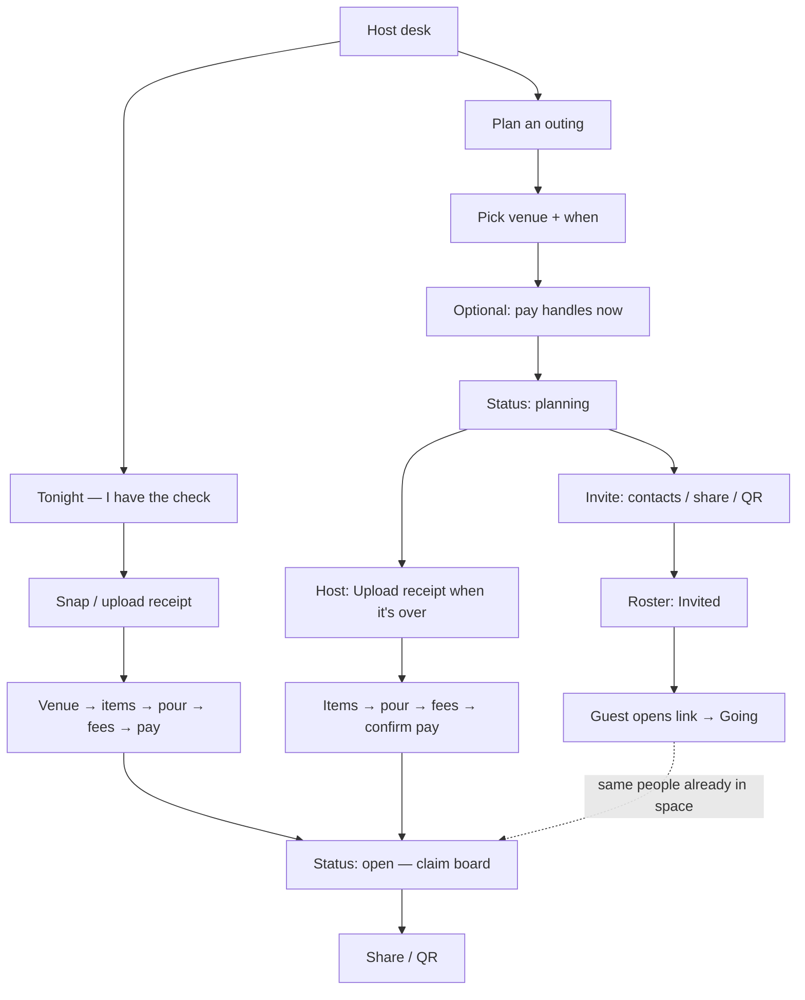

# Plan an outing (RSVP) + Tonight (receipt) — dual host paths

Status: **product + UX plan — not scheduled.**  
Related: [ui-flows.md](./ui-flows.md), [phase-2-venue.md](./phase-2-venue.md), [expected-party-size.md](./expected-party-size.md), [guest-first-reconcile.md](./guest-first-reconcile.md), [requirements.md](./requirements.md) §0.

---

## One-line idea

Give hosts **two ways to start the same outing**:

1. **Tonight** (current) — already at the table with the check → snap → publish → share.  
2. **Plan an outing** (new) — pick venue (+ time) → invite people → they **RSVP** → after the outing host **uploads the receipt into that space** → same claim / settle flow. Latecomers still get the same link.

One space. One night. Two entrances. Optional **per-person invites** so the host board shows **Invited → Going** when someone opens their link and taps yes.

---

## Why this belongs in Split the Wine

The “I put down the card” host often **knows days ahead** they’ll pay. Today they can’t invite anyone until the receipt is parsed. Planning an outing should not require inventing a second product (Evite + Splitwise).

RSVP here is **coordination for tonight’s table**, not a social network:

- No accounts  
- No permanent friend graph or contact sync to the cloud as a product feature  
- No long-lived events calendar  
- Link still expires with the outing  
- Host receipt remains truth for money  
- RSVP ≠ auto-claim (guests still tap what they had)

---

## Two paths (product conclusion)



| | **Tonight** | **Plan an outing** |
|---|---|---|
| When | Check in hand | Days / hours before |
| First artifact | Receipt photo | Venue + when + link |
| Guest early action | — | Invite → RSVP |
| Link timing | After publish | Immediately after create |
| After the outing | Already on claim board | Host attaches receipt → board unlocks claims |
| Latecomers | Share again | Same base link (or new invite) |

---

## Per-contact invites → Invited → Going (feasibility)

### Desired behavior

1. Host picks people (from device contacts or typed names) and sends **individually**.  
2. App records each person on the **host roster as Invited**.  
3. When that person opens **their** invite link and taps **Going**, roster flips **Invited → Going** (RSVP yes).  
4. Host sees live status without texting “did you get this?”

### Feasibility verdict

| Approach | Feasible? | Notes |
|---|---|---|
| **A. In-app contact / name picker → personalized invite link** | **Yes — recommended** | Host selects Sam → we create invitee row + token → `Share.share` / Messages with `/r/:id?invite=tok` → on Going, token binds RSVP to that row |
| **B. Generic OS share sheet and “know who they messaged”** | **No** | iOS/Android share targets do **not** return the recipient. App cannot mark Invited just because Share opened |
| **C. Upload full address book to server** | **No — don’t** | Breaks “no social graph”; App Review + privacy story get worse |
| **D. Host types names only, one generic link** | **Yes — lighter** | Roster starts empty until self-serve RSVP; no Invited state unless host adds names manually as Invited |
| **E. SMS via `sms:` / `Linking` with body prefilled** | **Yes — partial** | Host still chooses contact in Messages UI; we only get Invited if we created the invitee **before** opening Messages (same as A) |

**Bottom line:** Invited → Going works if the host **creates the invitee in-app first**, then shares a **tokenized link**. Relying on the system share sheet alone cannot record who was invited.

### Invitee status lifecycle

```text
(none) → Invited → Going
              ↘ Maybe
              ↘ Can't
              ↘ (expired / no response)
```

| Status | How it appears | Trigger |
|---|---|---|
| **Invited** | On host roster after host sends / saves invite | Host picks contact or adds name + shares that person’s link |
| **Going** | RSVP yes | Guest opens invite link (token preferred) and taps Going |
| **Maybe / Can’t** | Soft declines | Guest taps Maybe / Can’t |
| Self-serve **Going** (no prior invite) | Shows under Going; optional “walk-in” | Guest opens bare `/r/:id` and RSVPs (no token) |

When invite link opens:

1. Resolve `invite` token → prefill name (and optional contact).  
2. Primary CTA: **Going** (and Maybe / Can’t).  
3. On Going: `response: going`, clear Invited. Host board updates (SSE/poll — same live channel as claims).  
4. If token missing/invalid: fall back to blank RSVP form (still usable).

### Privacy / philosophy guardrails

- Contacts permission is **on-device picker only** (`expo-contacts` or system contact picker).  
- Server stores for **this outing only**: display name, optional phone/email the host chose to attach, invite token, RSVP state.  
- Not a reusable “host contacts” product DB across nights.  
- Tokens are unguessable; listing invitees requires host token.  
- Guest never has to install the app to RSVP (mobile web).

### Host invite UX (planning board)

```
Invite people
├─ Add from contacts     → multi-select → creates Invited rows → share one-by-one or “Send next”
├─ Add by name           → Invited row → Copy / Share that link
├─ Share group link      → bare /r/:id (no Invited rows; walk-in RSVPs)
└─ QR                    → same bare link (table poster / group chat)
```

Copy: **“Invite one-by-one to track who’s in — or drop one link in the group chat.”**

One-by-one send flow (keeps share sheet honest):

1. Host selects 3 contacts → 3 Invited rows.  
2. UI: “Send to Sam” → OS share with Sam’s personalized URL → mark `inviteSentAt`.  
3. Next: Jordan…  
4. Roster shows Invited until each taps Going.

Optional later: WhatsApp / Messages deep link with body; still requires pre-created invitee.

---

## Design principles (UI / UX)

1. **One composition, one job per screen** — Host desk offers two clear starts, not a dashboard of modes.  
2. **Brand + outing as hero** — Planning space shows venue / map / when as the hero, not a form farm.  
3. **Same base link for the outing** — `/r/:id`; personal invites only add `?invite=`.  
4. **Status-driven chrome** — Planning vs open vs closed change the board.  
5. **Progressive host setup** — Venue required; pay optional until open; invites optional (group link still works).  
6. **RSVP is light** — Going / Maybe / Can’t. Invited is host-side until yes.  
7. **Receipt attach is the ceremony** — “Outing’s over — add the check.” Venue already locked (confirm or change).  
8. **Pre-seed, don’t auto-claim** — Going names become suggested claimers.  
9. **Ephemeral** — Expire after `nightAt` (+ grace) or inactivity; no party archive.  
10. **Fair not equal still wins** — Money path unchanged once open.

Avoid: cards-as-decoration, vanity stat strips, calendar sync, ticket-QR-as-identity, uploading the address book.

---

## Host UX — Plan an outing

### Desk entry

```
Host desk
├─ Start a tab          → Tonight (existing ready / capture)
└─ Plan an outing?      → /host/plan
```

Copy angle: **“Going out later? Invite people before the check.”**

### Create outing (2–3 short steps)

1. **Where?** — Existing venue typeahead (Mapbox / MapKit). Required Places pin.  
2. **When?** — Date + optional time. Default: tonight.  
3. **Optional** — Expected headcount; note (“Birthday — I’m putting the card down”).  
4. **Pay** — Now or at attach time (optional early).

Primary CTA: **Create outing** → planning share / invite.

### Host planning board

Hero: venue, map/atmosphere, datetime.  
Body: roster grouped lightly — **Going** · **Invited** · **Maybe** · **Can’t** (don’t over-card it).  
Footer:

- **Invite people**  
- **Share group link** / QR  
- **Upload the check**  
- Edit venue / time / note  

Empty: “Invite friends — they’ll show as Invited until they tap Going.”

### Attach receipt

Same as before: capture → parse **into this id** → confirm venue → items → pour → fees → pay → **open**. Push optional: “Check is up — claim what you had.”

---

## Guest UX — same outing, two boards

### URL

- Group: `https://api.splitthewine.app/r/:id`  
- Personal: `https://api.splitthewine.app/r/:id?invite=<token>`

### Status = planning (+ invite token)

```
┌─────────────────────────────┐
│  Sat · Mar 14 · 7:30p       │
│  Maison Premiere            │
│  [ map / atmosphere ]       │
│                             │
│  Alex invited you.          │
│  They’re putting the card   │
│  down — claim after.        │
│                             │
│  Hi, Sam                    │  ← prefilled from invite
│                             │
│  [ Going ] [ Maybe ] [ Can't ]
└─────────────────────────────┘
```

Bare link (no token): name field empty; same buttons; becomes walk-in Going.

### Status = open

Claim board; name prefilled from Going; Invited-only people who never RSVP’d can still join via group link.

---

## Data model (sketch)

| Field | Notes |
|---|---|
| `id` | Public id in `/r/:id` |
| `hostToken` | Unchanged |
| `status` | `planning` \| `draft` \| `open` \| `closed` |
| `venue` / `nightAt` / `note` / `expectedPartySize` / `payments` | As needed |
| `invitees[]` | `{ id, personName, personContact?, inviteToken, response: invited\|going\|maybe\|cant, inviteSentAt?, updatedAt }` |
| `body` / items / fees | Empty until attach |
| `createdAt` / `expiresAt` | Ephemeral TTL |

`response: invited` is host-created; guest Going/Maybe/Can’t overwrites.

**Uniqueness:** reuse venue-day reservation so two plannings for the same place/night conflict with “Open your existing outing?”

---

## API sketch

| Endpoint | Behavior |
|---|---|
| `POST /api/receipts/plan` | Create `planning` outing |
| `POST /api/receipts/:id/invitees` | Host adds invitee(s) → returns personalized URLs |
| `POST /api/receipts/:id/rsvp` | Body includes optional `inviteToken`; sets going/maybe/cant |
| `GET /api/receipts/:id` | Public: venue, when, status, Going names (not Invited contacts). Host auth: full roster |
| Attach parse / publish / claims | Claims only when `open` |

---

## What this is **not**

| Idea | Why out |
|---|---|
| Inferring recipients from OS share sheet | OS doesn’t tell us |
| Cloud address book / social graph | Philosophy + review risk |
| Full event platform | Wrong product |
| Guest pre-orders as ledger | [guest-first-reconcile.md](./guest-first-reconcile.md) later assist only |
| Separate RSVP URL product surface | Confusing; use query token on same `/r/:id` |
| Auto-split by headcount | Fair-not-equal dies |

---

## Phased delivery

### Phase A′ (recommended MVP)

- Desk: **Plan an outing?**  
- Create: venue + when + group link  
- Guest: Going / Maybe / Can’t on `/r/:id`  
- Host planning board  
- **Upload the check** → same id → open → claim  
- Prefill Going names into claim  

### Phase B — Per-contact Invited → Going

- Contacts / name picker  
- `invitees` + personalized `?invite=` links  
- One-by-one send queue  
- Host roster: Invited vs Going  
- Public GET hides Invited PII  

### Phase C — Polish

- Pay-early optional  
- Push “check is up”  
- Expected size presence  
- Expiry / venue-day conflict  
- Web host create parity  

### Phase D — Optional

- Guest-first order drafts into this outing  

---

## UI flow maps

### Host — Plan an outing

```
Desk → Plan an outing?
  → Venue → When (+ optional size / note)
  → Pay now? (skip allowed)
  → Planning board
       ├ Invite people (contacts → Invited → share per link)
       ├ Share group link / QR
       └ Upload the check → … → Open → Live board
```

### Guest

```
Open /r/:id[?invite=]
  if planning → RSVP (Invited→Going when token + Going)
  if open     → Claim (name prefilled)
  if closed   → Closed / settle
```

---

## Risks & mitigations

| Risk | Mitigation |
|---|---|
| Expecting share sheet to mark Invited | Educate in UI; only in-app invite creates Invited |
| Contacts permission scare | Picker copy: “Stays on your phone — we only save who you invite to this outing” |
| Philosophy creep to events app | Copy: outing / table; no recurring |
| Token forwarding | Acceptable for v1 (like claim link); rotate optional later |
| Host forgets to attach receipt | Desk nudge after `nightAt` |
| Invite name ≠ claim name | Prefill + edit |

---

## Success criteria

- Host creates an outing without a photo and can share in &lt; 60 seconds.  
- Per-contact invite: host sees **Invited**, then **Going** when that person taps yes.  
- Group link still works without contacts.  
- Same URL becomes claim board after attach + publish.  
- Tonight path stays the fast table path.  
- No accounts; no uploaded address book; outings expire.

---

## Open choices (decide at build)

1. **Pay before first share?** Optional — force at open.  
2. **Maybe in v1?** Nice-to-have; Going + Can’t is enough if cutting.  
3. **Contacts in MVP or Phase B?** Recommend **Phase B** — ship group link + attach first; invites next.  
4. **`planning` vs overload `draft`?** Prefer explicit `planning`.  

---

## Suggested build order

1. `planning` + create + desk **Plan an outing?** + group share  
2. Guest RSVP on `/r/:id`  
3. Host planning board + attach receipt → open  
4. **Invitees + personalized links + Invited → Going**  
5. Presence / push / expiry  

Do **not** block on guest-first reconcile or voice.
