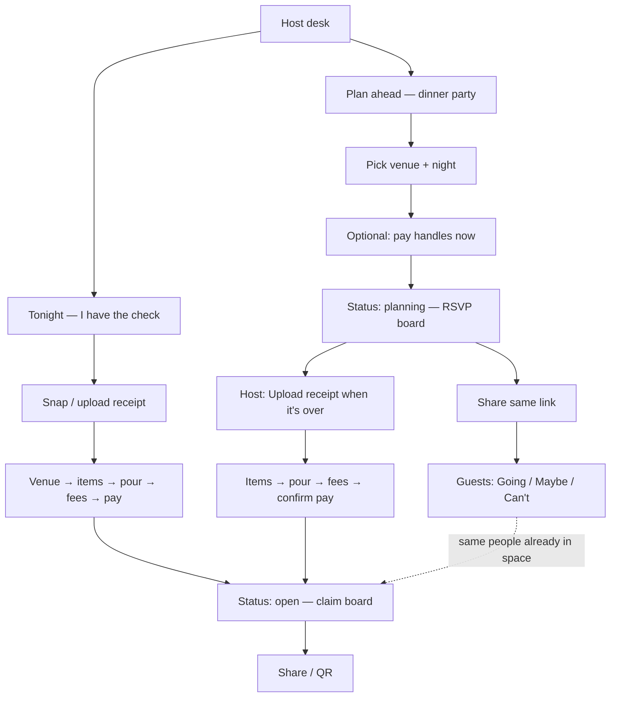

# Plan ahead (RSVP) + Tonight (receipt) — dual host paths

Status: **product + UX plan — not scheduled.**  
Related: [ui-flows.md](./ui-flows.md), [phase-2-venue.md](./phase-2-venue.md), [expected-party-size.md](./expected-party-size.md), [guest-first-reconcile.md](./guest-first-reconcile.md), [requirements.md](./requirements.md) §0.

---

## One-line idea

Give hosts **two ways to start the same night**:

1. **Tonight** (current) — already at the table with the check → snap → publish → share.  
2. **Plan ahead** (new) — pick venue (+ night) → share one link → friends **RSVP** → after dinner host **uploads the receipt into that space** → same claim / settle flow. Latecomers still get the same link.

One space. One link. Two entrances.

---

## Why this belongs in Split the Wine

The “I put down the card” host often **knows days ahead** they’ll pay. Today they can’t invite anyone until the receipt is parsed. Planning a dinner party should not require inventing a second product (Evite + Splitwise).

RSVP here is **coordination for tonight’s table**, not a social network:

- No accounts  
- No friend graph  
- No permanent events calendar  
- Link still expires with the night  
- Host receipt remains truth for money  
- RSVP ≠ auto-claim (guests still tap what they had)

---

## Two paths (product conclusion)



| | **Tonight** | **Plan ahead** |
|---|---|---|
| When | Check in hand | Days / hours before |
| First artifact | Receipt photo | Venue + night + link |
| Guest early action | — | RSVP only |
| Link timing | After publish | Immediately after create |
| After dinner | Already on claim board | Host attaches receipt → board unlocks claims |
| Latecomers | Share again | Same link (RSVP or claim, by status) |

---

## Design principles (UI / UX)

1. **One composition, one job per screen** — Host desk offers two clear starts, not a dashboard of modes.  
2. **Brand + night as hero** — Planning space shows venue name / map / date as the hero, not a form farm.  
3. **Same link forever for that night** — `/r/:id` (or alias `/n/:id` → same). Guests bookmark once.  
4. **Status-driven chrome** — Planning vs open vs closed change the board; guests never juggle two URLs.  
5. **Progressive host setup** — Venue required to create; pay handles can be now or at attach time; party size optional.  
6. **RSVP is light** — Name + Going / Maybe / Can’t. Contact optional (same as join today). No “bring a plus-one” graph in v1.  
7. **Receipt attach is the ceremony** — Big, calm CTA: “Dinner’s over — add the check.” Then reuse capture → parse → items… with venue **already locked** (confirm or change).  
8. **Pre-seed, don’t auto-claim** — Going guests appear as **suggested claimers** (name chips). They still claim lines. No silent assignment.  
9. **Ephemeral** — Planning nights expire (e.g. 7 days after `nightAt`, or 48h after last activity if never attached). No archive of parties.  
10. **Fair not equal still wins** — Money path unchanged once open.

Avoid: cards-as-decoration, pill cluster stats in the hero, “event management” chrome, calendar sync, ticket QR as identity.

---

## Host UX — Plan ahead

### Desk entry

```
Host desk
├─ Start a tab          → Tonight (existing ready / capture)
└─ Plan a dinner        → new /host/plan (or /host/ahead)
```

Copy angle: **“Hosting later? Share a link before the check.”**

### Create night (2–3 short steps)

1. **Where?** — Existing venue typeahead (Mapbox / MapKit). Required Places pin (same bar as today).  
2. **When?** — Date + optional time (local). Default: tonight.  
3. **Optional** — Expected headcount (ties to [expected-party-size.md](./expected-party-size.md)); note (“Birthday — I’m putting the card down”).  
4. **Pay** — Soft gate: “Add how people can pay you” now **or** “I’ll add this when I upload the check.”  
   - If skip: space is planning-only until pay is set at attach.  
   - Prefer collecting pay early so attach is faster after dinner.

Primary CTA: **Create link** → land on **planning share** (Copy / Share / QR — reuse share chrome).

### Host planning board (live while status = planning)

Hero: venue name, static map or photo strip, night datetime.  
Body: RSVP list (Going / Maybe / Can’t counts — simple, not a stat strip of vanity metrics).  
Footer CTAs:

- **Share invite**  
- **Upload the check** (primary when dinner should be over; always available)  
- Edit venue / time / note  

Empty RSVP: calm empty state — “Share the link — friends tap Going.”

### Attach receipt (bridge into tonight flow)

1. Host taps **Upload the check** → capture / library (same as tonight).  
2. Parse into **this** night’s id (not a new receipt id).  
3. Restaurant step: venue **pre-filled / locked** with “Looks right?” confirm; change only if wrong place.  
4. Items → pour → fees → pay (if missing) → **Open claims**.  
5. Status flips `planning` → `open`. Guests already in the space refresh into the claim board. Push optional: “Check is up — claim what you had.”

---

## Guest UX — same link, two boards

### URL

Keep **`/r/:id`** as the public surface (claim mental model already shipping). Optional pretty path later; not required for v1.

### Status = planning

```
┌─────────────────────────────┐
│  Sat · Mar 14 · 7:30p       │
│  Maison Premiere            │
│  [ map / atmosphere ]       │
│                             │
│  Alex is putting the card   │
│  down — claim after dinner. │
│                             │
│  Your name                  │
│  [____________]             │
│                             │
│  [ Going ] [ Maybe ] [ Can't ]
│                             │
│  Going (4)                  │
│  · Sam  · Jordan  · …       │
└─────────────────────────────┘
```

- No item claims yet.  
- Edit RSVP anytime until open (or until closed).  
- Optional contact (same privacy posture as join).  
- Device-local remember: returning guest sees their RSVP without retyping (same pattern as `saveGuest`).

### Status = open

Current claim board, with upgrades:

- Banner: “You’re on the list — claim what you had.”  
- Name prefilled from RSVP when possible.  
- Going names as soft presence (“4 of ~6 on the list have claimed”) — complements expected party size.  
- Guests who never RSVP’d can still join + claim (link is not exclusive).

### Status = closed / expired

Existing settle / closed copy; planning-only nights that never got a receipt show “This night never got a check” + expire.

---

## Data model (sketch)

Extend the receipt document (or thin `nights` row that becomes a receipt) — prefer **one object** so the link never changes:

| Field | Notes |
|---|---|
| `id` | Public token in `/r/:id` |
| `hostToken` | Unchanged |
| `status` | `planning` \| `draft` \| `open` \| `closed` (today: draft/open/closed) |
| `venue` | Required for planning create |
| `nightAt` | ISO datetime (local intent stored with offset) |
| `note` | Host message |
| `expectedPartySize` | Optional |
| `payments` | Optional until open |
| `rsvps[]` | `{ id, personName, personContact?, response, updatedAt }` |
| `body` / items / fees | Empty until attach + parse |
| `createdAt` / `expiresAt` | Ephemeral TTL |

**Publish rules**

- `planning` → shareable; claims API returns 409 / friendly “not open yet.”  
- Attach parse writes items into same id; then host review; then `open`.  
- Tonight path: parse creates `draft` as today; never enters `planning` unless we add “convert draft → planning” (out of scope).

**Uniqueness:** `venue_day_taken` already exists for open tabs — planning nights should reserve the same venue-day key so two planning links for the same place/night don’t collide; define conflict UX (“You already have a night here — open it?”).

---

## API sketch

| Endpoint | Behavior |
|---|---|
| `POST /api/receipts/plan` | Create `planning` night (venue + nightAt + optional note/size/pay) |
| `GET /api/receipts/:id` | Include `status`, `rsvps`, venue; omit claim totals until open |
| `POST /api/receipts/:id/rsvp` | Upsert RSVP by soft identity (name + device token / contact) |
| `POST /api/receipts/:id/parse` or existing draft update | Attach image → fill items while staying host-authenticated |
| Existing publish / claims | Claims only when `open` |

Push (Phase 1 host push adjacent): notify RSVP’d devices when status → `open` (“Time to claim”).

---

## What this is **not**

| Idea | Why out |
|---|---|
| Full event platform (plus-ones, meals, seats) | Wrong product |
| Guest pre-orders as ledger | That’s [guest-first-reconcile.md](./guest-first-reconcile.md) — optional later **assist**, still not truth |
| Accounts / “my parties” history | Philosophy break |
| Separate RSVP URL and claim URL | Guests get lost; host double-shares |
| Auto-splitting by RSVP headcount | Fair-not-equal dies |

---

## Phased delivery

### Phase A — Planning create + RSVP board (MVP)

- Desk: **Plan a dinner**  
- Create: venue + when + create link  
- Guest: Going / Maybe / Can’t  
- Host planning board + share chrome  
- No receipt attach yet (host still uses Tonight for money) — *optional cut* if we want vertical slice faster  

**Better MVP cut:** include attach in A so the story is complete.

### Phase A′ (recommended MVP)

A + **Upload the check** → parse into same id → items/fees/pay → open → claim. Venue prefilled. RSVPs prefill names.

### Phase B — Polish

- Pay-early optional  
- Push “check is up” to RSVPs  
- Expected size + “4 of ~6 claimed”  
- Expire / conflict for venue-day  
- Web parity for planning board  

### Phase C — Optional later

- Guest-first order drafts reconcile into this night ([guest-first-reconcile.md](./guest-first-reconcile.md))  
- Host tip note / dress code as rich note only  

---

## UI flow maps (keep in sync with ui-flows.md when building)

### Host — Plan ahead

```
Desk → Plan a dinner
  → Venue
  → When (+ optional size / note)
  → Pay now? (skip allowed)
  → Share (planning)
  → Planning board
       ├ Share again
       └ Upload the check → Capture → Parse → Confirm venue
            → Items → Pour → Fees → Pay (if needed) → Open → Live board
```

### Guest — One link

```
Open /r/:id
  if planning → RSVP
  if open     → Join (name prefilled) → Claim → Settle
  if closed   → Closed / settle summary
```

### Host — Tonight (unchanged spine)

```
Desk → Start a tab → Capture → … → Pay → Share → Live board
```

---

## Risks & mitigations

| Risk | Mitigation |
|---|---|
| Host creates planning night, forgets to attach | Expiry + desk nudge “Dinner was yesterday — add the check?” |
| Philosophy creep toward events app | Strict copy: “for tonight’s table”; no recurring / public discovery |
| RSVP names ≠ claim names | Prefill + edit; never force match |
| Two hosts plan same venue-night | venue-day conflict dialog |
| Guests think RSVP = paid | Copy: “You’ll claim what you ordered after the check goes up” |
| Parse attaches to wrong night | Always attach into current planning id; never silent new id |

---

## Success criteria

- Host can create a night **without** a photo and share a working link in &lt; 60 seconds.  
- Guest can RSVP on mobile web without installing.  
- After attach + publish, **same URL** becomes the claim board; Going guests see themselves.  
- Tonight path remains the default fast path at the table (no extra steps).  
- No new account system; nights still expire.

---

## Open choices (decide at build)

1. **Pay required before first share?** Recommend **optional** — friction kills planning; force at open.  
2. **Maybe / Can’t in v1?** Recommend **Going + Can’t** only if we need to cut; Maybe is nice socially.  
3. **Reuse `draft` vs new `planning` status?** Prefer explicit `planning` so draft stays “photo exists, not published.”  
4. **Web host plan flow** same week as mobile, or mobile-first? Recommend **mobile + web claim/RSVP**; host create can be mobile-first.

---

## Suggested build order

1. Status `planning` + create API + desk entry + share  
2. Guest RSVP UI on `/r/:id`  
3. Host planning board  
4. Attach receipt into same id → existing interview from items (venue confirm) → open  
5. Prefill / presence polish + expiry  

Do **not** block on guest-first reconcile or voice.
