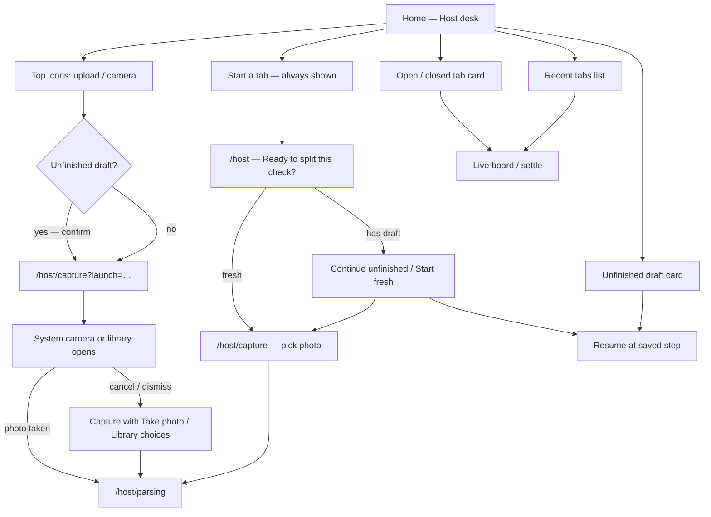
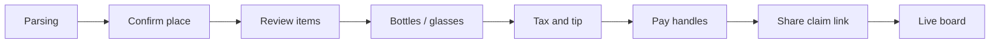
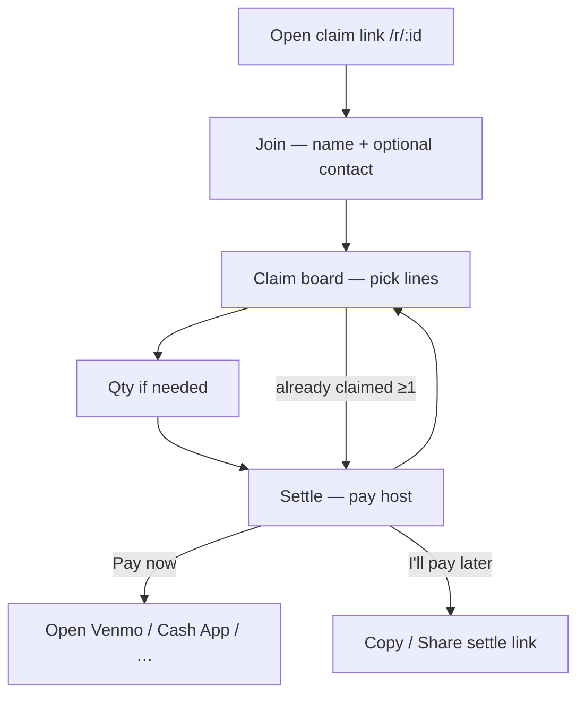

# Host & guest UI flows

How people enter Split the Wine on mobile (and where web claimants join). Keep this in sync when entry points change.

## Host desk — two ways to start a tab

## Host interview after the photo

Parsing is a loading screen (no step count). Counted steps are Ready → Capture → Place → Items → Pour → Fees → Pay → Share (8). Ready is skipped on the icon shortcut path.

## Guest claim (web + app)

## Notes

- **Start a tab** always stays on Home so canceling a camera shortcut never traps you without a guided way back in.
- Icon shortcuts clear the local draft (with confirm) then auto-open camera/library; cancel falls back to the normal capture choices.
- Web guests do not see Host desk; they only use the claim link path above.
